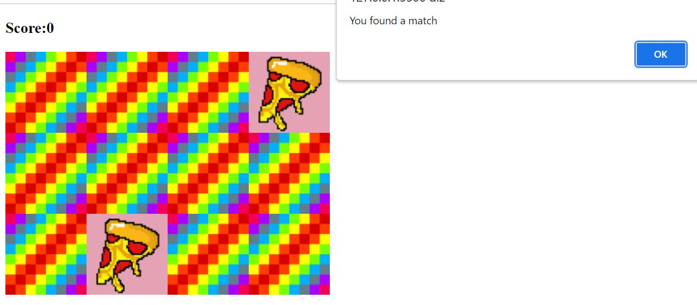

# Memory card game

This is a project of a simple game developed using JavaScript. The name of the game is 'The Memoy Game'. You have a colorful board and it is composed by different cards with images of different food or drinks. You have to choose two options from the board, if the cards have the same image, you have a match, if not, you lose. 

Don´t worry, you have other chances to choose until you find all the matches and win the game. But for this, you got have a good memory, because each pair of cards chosen will flip after you click on them. 

Let´s have some fun!

